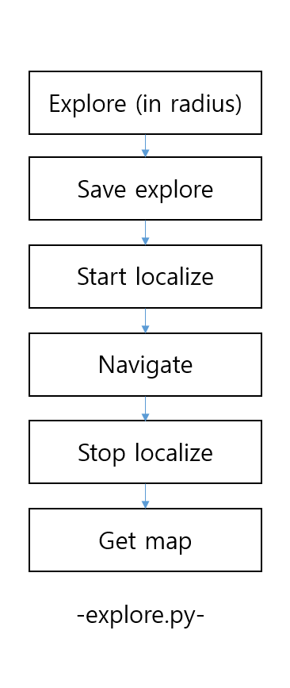
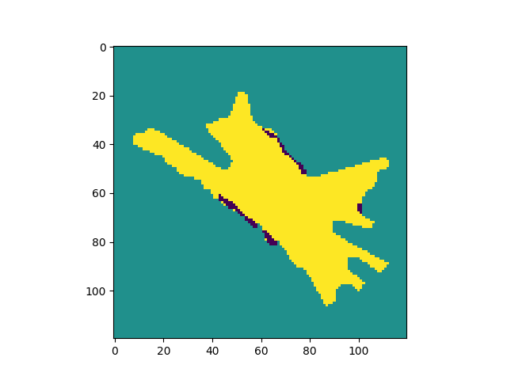
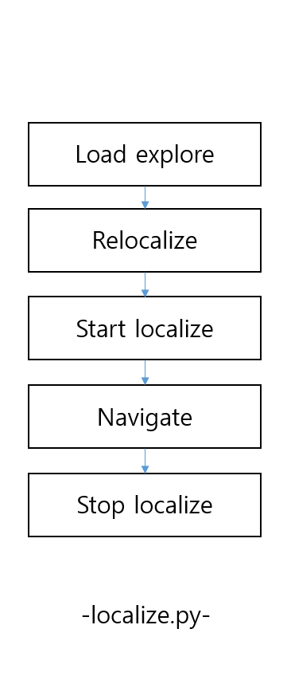

## Exploration API

~~~ py 
class ALNavigationProxy 
~~~

페퍼와 함께 exploration method를 사용할 수 있다:

- ALNavigationProxy::explore
- ALNavigationProxy::stopExploration
- ALNavigationProxy::saveExploration
- ALNavigationProxy::getMetricalMap
- ALNavigationProxy::navigateToInMap
- ALNavigationProxy::getRobotPositionInMap
- ALNavigationProxy::loadExploration
- ALNavigationProxy::relocalizeInMap
- ALNavigationProxy::startLocalization
- ALNavigationProxy::stopLocalization

--- 
### Experimental Methods

#### qi::Future<int> ALNavigationProxy::explore(float radius)

페퍼는 파라미터로 전달받은 반지름의 범위 내에서 자신의 주변 환경을 자율적으로 탐색한다.

#### Parameters:	
반지름 – 최대 탐색 거리 (meter).
#### Returns:	
최종 상태의 에러 코드를 보유하는 데이터.

---
#### void ALNavigationProxy::stopExploration()
진행중인 탐색이나 위치 추정을 중지한다. 

---

#### std::string ALNavigationProxy::saveExploration()¶
현재 탐색 데이터를 디스크에 저장하여 나중에 사용할 수 있게 한다.

- Return : 생성된 .explo 파일의 경로의 문자열

---
#### ALValue ALNavigationProxy::getMetricalMap()
현재 불러온 탐색을 바탕으로 지도를 반환한다 : [mpp, width, height, [originOffsetX, originOffsetY], [pxlVal, ...]]

- mpp는 화소 당 미터 단위의 지도 해상도,
- width와 height는 이미지 픽셀의 사이즈,
- originOffset은 지도 픽셀 (0,0)의 계측적 오프셋이다.
- 그리고 [pxlVal, ...]은 0(사용한 공간/갈 수 없는)에서 100(자유 공간/갈 수 있는)사이의 픽셀 부동 소수점 값의 버퍼이다. 
  
---

#### qi::Future<int> ALNavigationProxy::navigateToInMap(const std::vector<float>& target)
탐색한 지도를 바탕으로 페퍼가 원하는 목표로 이동하도록 한다.

예외 : 탐색을 로드하지 못했거나 위치 추정을 실행하지 못했을 경우.

참고 : 현재, 페퍼는 최종 목표로 theta를 사용하지 않는다. 최종 방향의 각도를 조절하기 위해서 ALMotion.moveTo를 사용할 수 있다.

- Parameters:	
target – [x, y, theta] 탐색한 맵 프레임에서의 목표.
- Returns:	
에러 코드.
---

#### ALValue ALNavigationProxy::getRobotPositionInMap()

현재 탐색한 지도 프레임에서 로봇의 위치를 추정한다.

예외 : 탐색을 로드하지 못했거나 위치 추정을 실행하지 못했을 경우.

- Returns : 추정된 위치 Pose의 ALValue

---
#### qi::Future<bool> ALNavigationProxy::loadExploration(std::string path)
디스크에 위치한 .explo를 불러온다. 

- Returns: 탐색 파일 로드를 성공 했을 때 반환.

---

#### qi::Future<ALValue> ALNavigationProxy::relocalizeInMap(const std::vector<float>& estimation)

localizer에게 추정된 포즈 주위로 다시 추정 할 것을 요청한다.

예외 : 탐색을 불러오지 못했을 경우.

- Parameters:	
estimation – [x, y, theta] 지도 프레임에서 로봇의 추정된 포즈
- Returns:	
a Future holding the resulting localized pose formatted as follow.

---
#### void ALNavigationProxy::startLocalization()

로봇의 위치 추정을 계산하는 탐색 루프를 시작한다. 

예외 : 탐색 파일을 로드하지 못했을 경우.

---
#### void ALNavigationProxy::stopLocalization()

로봇이 위치 추정을 계산하는 탐색 루프를 정지한다.

위치 추정 루프가 실행중이 아니라면 동작하지 않는다. 

---

### Custom types

#### Localized Pose

위치 추정 포즈는 다음과 같이 정의된다 :

[Pose, Uncertainty]

- 포즈는 localizer가 계산한 [X, Y, theta].
- Uncertainty는 위치 추정 포즈의 불확실성 정의하는 [radiusX, radiusY, orientation] 파라미터를 가진 타원이다.

#### Error code

1. 좋다.
2. 좋지 않다.
3. 취소됐다.
4. 목표에 도달했다.
5. 목표에 도달하지 못했다.
6. 목표가 맵에 없다.
   

---

### Code samples

#### 탐색의 파이썬 코드

다음 스크립트는 로봇이 반경 2m의 지역을 탐색하게 하고, 정상적으로 동작했다면 탐색 파일을 디스크에 저장하고 출발점으로 돌아와 결과 지도를 표시한다.

explore.py    / 첫 탐색을 위한 스크립트

~~~ py
#! /usr/bin/env python
# -*- encoding: UTF-8 -*-

"""예제 : 탐색 method를 사용한다. """

import qi
import argparse
import sys
import numpy
import Image

def main(session):
    """
    이것은 탐색 method를 사용하는 예제이다.
    """
    # ALNavigation, ALMotion를 프록시로 할당한다.
    navigation_service = session.service("ALNavigation")
    motion_service = session.service("ALMotion")

    # 로봇 깨우기 구동.
    motion_service.wakeUp()

    # 반경 2m 내의 주변 환경 탐색
    radius = 2.0
    error_code = navigation_service.explore(radius)
    if error_code != 0:
        print "Exploration failed."
        return
    # 탐색을 디스크에 저장.
    path = navigation_service.saveExploration()
    print "Exploration saved at path: \"" + path + "\""
    # 위치 추정을 사용해 지도에서 길찾기.
    navigation_service.startLocalization()
    # 초기 위치로 돌아온다.
    navigation_service.navigateToInMap([0., 0., 0.])
    # 위치 추정 중지.
    navigation_service.stopLocalization()
    # 로봇이 만든 지도 검색 및 표시
    result_map = navigation_service.getMetricalMap()
    map_width = result_map[1]
    map_height = result_map[2]
    img = numpy.array(result_map[4]).reshape(map_width, map_height)
    img = (100 - img) * 2.55 # from 0..100 to 255..0
    img = numpy.array(img, numpy.uint8)
    Image.frombuffer('L',  (map_width, map_height), img, 'raw', 'L', 0, 1).show()

# 로봇 연결 

if __name__ == "__main__":
    parser = argparse.ArgumentParser()
    parser.add_argument("--ip", type=str, default="127.0.0.1",
                        help="Robot IP address. On robot or Local Naoqi: use '127.0.0.1'.")
    parser.add_argument("--port", type=int, default=9559,
                        help="Naoqi port number")

    args = parser.parse_args()
    session = qi.Session()
    try:
        session.connect("tcp://" + args.ip + ":" + str(args.port))
    except RuntimeError:
        print ("Can't connect to Naoqi at ip \"" + args.ip + "\" on port " + str(args.port) +".\n"
               "Please check your script arguments. Run with -h option for help.")
        sys.exit(1)
    main(session)

~~~
#### Result map

#### 위치 추정 파이썬 스크립트
다음 파이썬 스크립트는 인자로 주어진 지도를 읽어오고, 지도 안에서 페퍼의 위치를 다시 지정하며, 지도의 위치로 이동한다. 

localize.py   / 탐색한 지도를 바탕으로 다시 위치추정을 하는 스크립트

~~~py 

#! /usr/bin/env python
# -*- encoding: UTF-8 -*-

"""예제 : 위치 추정 method 사용하기 """

import qi
import argparse
import sys

def main(session, exploration_file):
    """
    이것을 위치 추정 method를 사용하는 예제이다.
    """
    # ALNavigation, ALMotion를 프록시로 할당한다.
    navigation_service = session.service("ALNavigation")
    motion_service = session.service("ALMotion")

    # 로봇 깨우기 구동.
    motion_service.wakeUp()

    # 저장된 이전 탐색 파일을 불러온다.
    navigation_service.loadExploration(exploration_file)

    # 로봇의 위치를 다시 추정한다.
    guess = [0., 0.] # 로봇이 저장된 탐색 파일이 시작한 곳에서 멀지 않다고 가정한다.
    navigation_service.relocalizeInMap(guess)
    navigation_service.startLocalization()

    # 지도의 다른 위치로 이동
    navigation_service.navigateToInMap([2., 0., 0.])

    # 로봇의 도착을 확인.
    print "I reached: " + str(navigation_service.getRobotPositionInMap()[0])

    # 위치 추정 정지.
    navigation_service.stopLocalization()

if __name__ == "__main__":
    parser = argparse.ArgumentParser()
    parser.add_argument("--ip", type=str, default="127.0.0.1",
                        help="Robot IP address. On robot or Local Naoqi: use '127.0.0.1'.")
    parser.add_argument("--port", type=int, default=9559,
                        help="Naoqi port number")
    parser.add_argument("--explo", type=str, help="Path to .explo file.")

    args = parser.parse_args()
    session = qi.Session()
    try:
        session.connect("tcp://" + args.ip + ":" + str(args.port))
    except RuntimeError:
        print ("Can't connect to Naoqi at ip \"" + args.ip + "\" on port " + str(args.port) +".\n"
               "Please check your script arguments. Run with -h option for help.")
        sys.exit(1)
    main(session, args.explo)

~~~